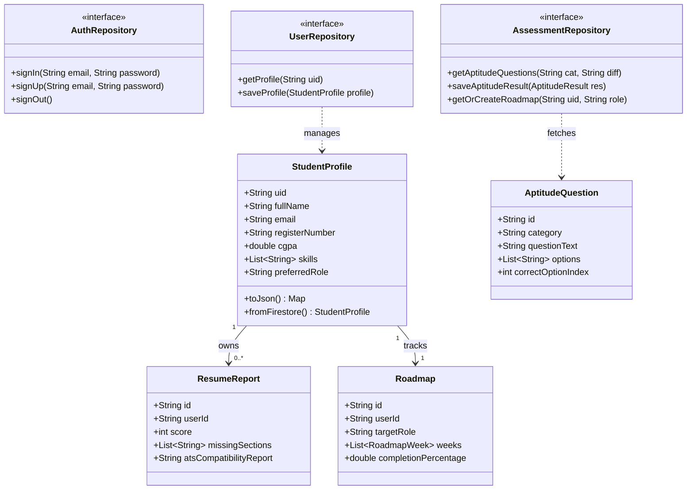
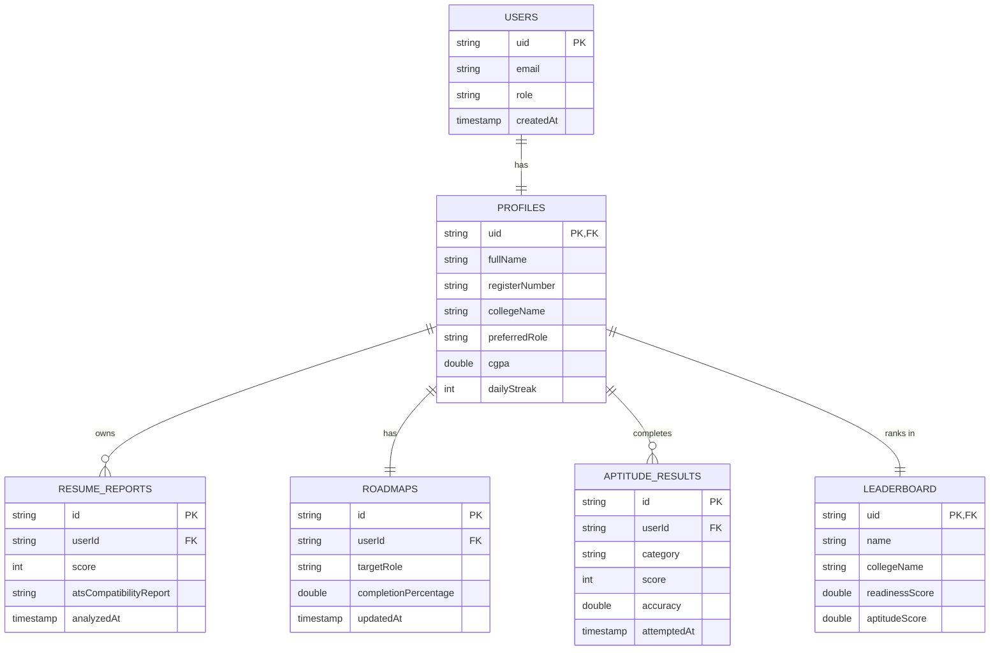
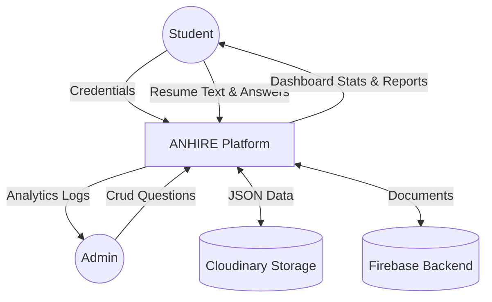
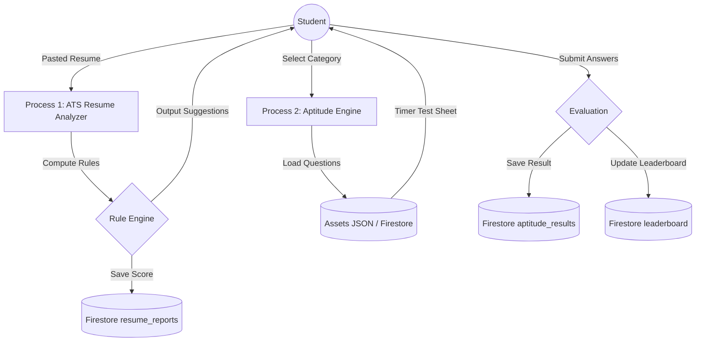

# Academic Project Documentation - ANHIRE

This file contains the complete suite of engineering documentation required for B.Tech / KTU academic evaluation, final project submission, viva, and project demonstrations.

---

## 1. Software Requirements Specification (SRS)

### 1.1 Introduction
ANHIRE is an AI-powered placement preparation platform designed to help students optimize their placement readiness. It provides rule-based resume analysis, aptitude mock testing, mock technical/HR interviews, learning roadmaps, and ranking leaderboards. The application operates serverless on zero-cost free tiers (Firebase and Cloudinary).

### 1.2 User Roles
1. **Student:** Registers, sets preferred target roles, pastes resumes for ATS feedback, completes aptitude tests, answers oral mock interview text prompts, tracks roadmaps, views leaderboard ranks, and exports PDF portfolios.
2. **Admin:** Views student stats, manages user status, and manages aptitude question banks.

### 1.3 Functional Requirements
- **FR1 (Auth):** Secure email sign-up/in and Google OAuth login.
- **FR2 (Profile):** Form entry for CGPA, register number, and skills list.
- **FR3 (ATS Resume Audit):** Parser evaluating section headers, contact link details, targeted keywords, and length, providing a 0-100 score.
- **FR4 (Aptitude Engine):** Selection of categories and difficulty, randomized 10-question tests with timers, results, and step-by-step explanations.
- **FR5 (Mock Interview Terminal):** Selection of technical/HR topics, text-based answering, evaluation of answers based on keyword matching and Jaccard token overlap, and solution review.
- **FR6 (Roadmap & Skill Gap):** Matching student skills against target roles to output missing skills and a 4-week checkable roadmap.
- **FR7 (Leaderboard):** Global ranking and college ranking with filtering options.
- **FR8 (PDF Exports):** On-device generation of reports.
- **FR9 (Offline Support):** Caching data using Hive and queueing offline updates.

### 1.4 Non-Functional Requirements
- **NFR1 (Performance):** Offline read speeds of under 5ms using local caching.
- **NFR2 (Security):** Firestore rules ensuring users can only read/write their own records, and admin-only write permissions.
- **NFR3 (Scalability):** Normalized database schemas and composite indexing.

---

## 2. System Design Document

### 2.1 System Architecture Overview
The system adopts **Clean Architecture** combined with **MVVM (Model-View-ViewModel)** pattern:

```text
  ┌──────────────────────────────────────────────────────────┐
  │                   Presentation Layer                     │
  │     [Views/Screens] ──> [ViewModels / Riverpod States]   │
  └───────────────────────────┬──────────────────────────────┘
                              │
  ┌───────────────────────────▼──────────────────────────────┐
  │                      Domain Layer                        │
  │     [Entities/Models] <── [Repository Contracts]         │
  └───────────────────────────┬──────────────────────────────┘
                              │
  ┌───────────────────────────▼──────────────────────────────┐
  │                      Data Layer                          │
  │ [Repository Impl] ──> [Firestore API / Hive Cache API]   │
  └──────────────────────────────────────────────────────────┘
```

- **Models:** Defines data structures (Profile, ResumeReport, TestResult, etc.) with JSON serialization.
- **Repositories:** Abstract interfaces implemented by Firestore/Hive database wrappers.
- **Providers (ViewModels):** Riverpod notifiers that manage state variables and trigger repository actions.
- **Screens (Views):** Flutter widgets displaying the state and responding to user actions.

---

## 3. Database Design Document

### 3.1 Entity Relationship diagram (ERD) Schema
Refer to the Mermaid ERD in Section 4.3.
Firestore is structured as flat root-level collections for speed, minimizing nested subcollections to keep reads low:
- `users`: User metadata (email, role).
- `profiles`: Detailed student records (register number, CGPA, target role).
- `resume_reports`: ATS diagnostic outcomes.
- `aptitude_results`: Score records for aptitude tests.
- `interview_results`: Score records for mock interviews.
- `roadmaps`: 4-week task checklists.
- `leaderboard`: Rank-ordered entries.
- `notifications`: Alerts for practice tasks.

---

## 4. System Diagrams (Mermaid Format)

*Copy the code below into any Mermaid live editor (e.g., mermaid.live) to render.*

### 4.1 Use Case Diagram
```mermaid
usecaseDiagram
    rect rgba(37, 99, 235, 0.05)
        note right of Student : Candidate preparing for placement
        note right of Admin : Placement administrator
        
        Student --> (Login / Register)
        Student --> (Manage Profile)
        Student --> (Analyze Resume)
        Student --> (Take Aptitude Test)
        Student --> (Attend Mock Interview)
        Student --> (Track Roadmap)
        Student --> (View Leaderboard)
        Student --> (Export PDF Report)
        
        Admin --> (Login)
        Admin --> (Manage Users)
        Admin --> (Manage Question Bank)
        Admin --> (View System Analytics)
    end
```

### 4.2 Class Diagram


### 4.3 Entity-Relationship Diagram (ERD)


### 4.4 Data Flow Diagram (DFD) Level 0 (System Context)


### 4.5 Data Flow Diagram (DFD) Level 1 (Process Detail)


---

## 5. User Manual

### 5.1 Student Workflow
1. **Registration:** Open the app, tap "Create account", enter your email and password, and register.
2. **Setup Profile:** Log in, navigate to "My Profile", fill in your register number, college name, branch, current semester, CGPA, and list your current skills. Select your target placement role (e.g. Flutter Developer) and save.
3. **ATS Resume Check:** Paste your plain text resume. Tap "Analyze Resume". The dashboard will display your score out of 100, checking for contact detail URLs and highlighting missing sections.
4. **Practice Aptitude Tests:** Select "Aptitude Tests", choose a difficulty, and start. Complete the 10 questions before the timer runs out. Tap "Finish" to view your score, correct options, and step-by-step explanations.
5. **Take Mock Interviews:** Select "Mock Interviews", choose a topic (e.g. DBMS), and type your answers. Tap "Finish" to view your keyword matching score and feedback.
6. **Track Roadmap Progress:** View "Learning Roadmap" to see weekly task items generated based on your target role. Tick items off as you learn them to increase your completion percentage.
7. **Check Ranks:** Open the "Leaderboard" to view your rank globally or filtered by college.
8. **Download Report:** Tap the PDF icon on the dashboard to export your complete readiness report.

### 5.2 Admin Workflow
1. **Login:** Log in with `admin@placementpro.com` and password `anandhu@123`.
2. **Dashboard Overview:** View registered student statistics, average scores, and active user metrics.
3. **Disable Users:** Scroll through the student roster and tap "Disable" to temporarily restrict access.
4. **Manage Question Bank:** Navigate to "Manage Question Bank", choose a category filter, and click the "+" icon to add a new question, or click "Edit" on an existing question to update it.

---

## 6. Installation & Deployment Guide

### 6.1 Flutter Setup
1. Download and install [Flutter SDK](https://docs.flutter.dev/get-started/install). Verify installation:
   ```bash
   flutter doctor
   ```
2. Extract the ANHIRE source code folder.
3. Fetch dependencies:
   ```bash
   flutter pub get
   ```

### 6.2 Firebase Setup
1. Create a project in [Firebase Console](https://console.firebase.google.com).
2. Enable **Email/Password** and **Google** Sign-in options in Authentication.
3. Create a **Cloud Firestore** database.
4. Add an Android app with package name `com.example.anhire` or standard `com.placementpro.anhire`. Download the `google-services.json` file.
5. Place `google-services.json` in: `android/app/google-services.json`.
6. Add an iOS app and place the downloaded `GoogleService-Info.plist` inside `ios/Runner/GoogleService-Info.plist`.

### 6.3 Cloudinary Setup
1. Register for a free account on [Cloudinary](https://cloudinary.com).
2. Note down your **Cloud Name** in the Dashboard.
3. Go to Settings -> Upload, scroll down to Upload presets, and click **Add Upload Preset**.
4. Set the Preset Name to `anhire_unsigned`, set Signing Mode to **Unsigned**, select a folder (e.g. `resumes`), and save.
5. Open `lib/core/services/cloudinary_service.dart` and update the constants:
   ```dart
   static String cloudName = "your_cloudinary_cloud_name";
   static String uploadPreset = "anhire_unsigned";
   ```

### 6.4 Seeding the Database
1. Set up python environment:
   ```bash
   pip install firebase-admin
   ```
2. Place your service account key JSON inside `assets/serviceAccountKey.json`.
3. Run the seeder script to populate Firestore:
   ```bash
   python assets/seed_firestore.py
   ```

### 6.5 Building the Application
- To run the application in debug mode:
  ```bash
  flutter run
  ```
- To compile a release APK for Android:
  ```bash
  flutter build apk --release
  ```
  The generated APK will be located at: `build/app/outputs/flutter-apk/app-release.apk`.
